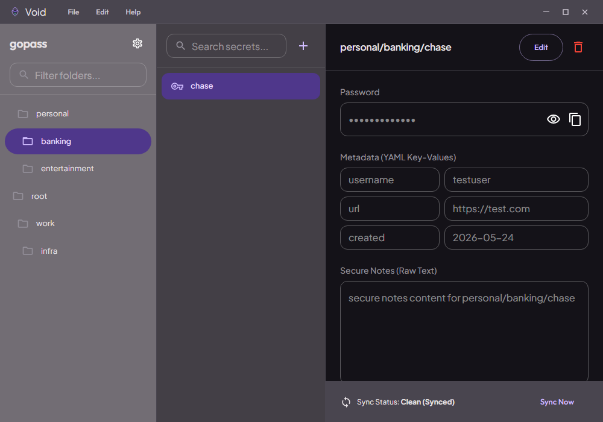
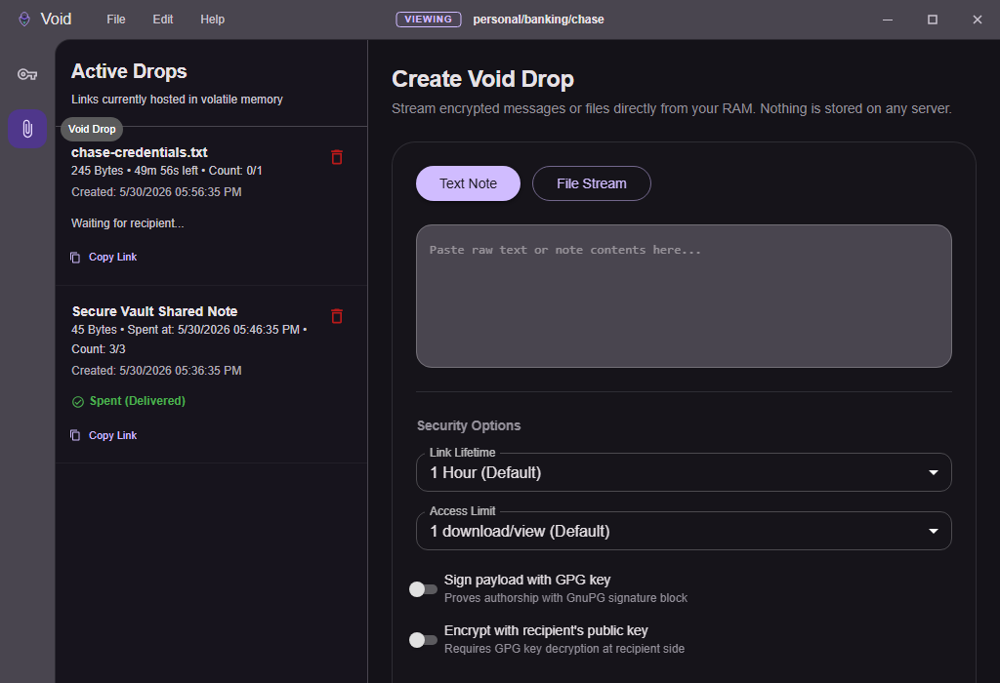
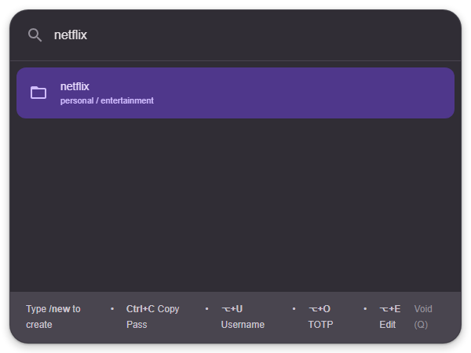
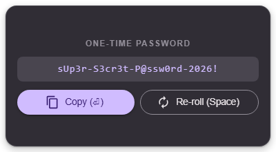

<p align="center">
  
</p>

<h1 align="center">Void</h1>

<p align="center">
  <strong>A premium, secure, Material Design 3 cross-platform GUI wrapper for the <a href="https://github.com/gopasspw/gopass">gopass</a> CLI.</strong>
</p>

<p align="center">
  <a href="https://github.com/duhruh/void/actions/workflows/build-and-release.yml"></a>
  <a href="https://github.com/duhruh/void/releases"></a>
  <a href="LICENSE"></a>
  <a href="https://github.com/gopasspw/gopass"></a>
</p>

---

Void is a beautiful, secure, frameless desktop client for `gopass`. Written in Electron, React, and TypeScript, it is designed from the ground up to follow modern **Material Design 3** aesthetics, featuring rich dynamic HSL-based color themes, glassmorphism panel overlays, and smooth micro-animations.

Void prioritizes security (enforcing screen capture and recording protection out of the box) while providing a frictionless user experience with global search hotkeys, a custom password generator overlay, and automatic background Git synchronization.

---

## ✨ Features

- **🔍 Quick Access Search Overlay**: Toggle a Raycast/Alfred-like floating bar using `Ctrl+Shift+P` to search and copy passwords, usernames, and TOTP codes instantly.
- **🎲 Password Generator Overlay**: Press `Ctrl+Shift+G` to pop up a compact password generator card, Space to re-roll, and Enter to copy and close.
- **🎛️ Three-Pane Dashboard**:
  - **Pane 1**: Live folder/directory tree structure compiled from your secrets.
  - **Pane 2**: Quick lists of secrets in the active folder.
  - **Pane 3**: Rich editor supporting dynamic key-value metadata fields, password strength visualizer, and Markdown-rendered secure notes.
- **🌌 Void Drop (P2P Ephemeral Sharing)**: Stream text notes or binary files directly from your volatile RAM to a recipient's browser using end-to-end encrypted WebRTC channels (zero server persistence). Supports GPG signing/encryption, configurable lifetimes (max 24h), and download access limits.
- **⚡ Fully Custom Shortcuts**: Record key combinations directly in settings to customize all global and inside-Quick-Access hotkeys.
- **🔄 Auto Sync**: Triggers automated Git push/pull syncs with remote repositories on write operations.
- **🔒 Screen-Capture Protection**: Enforces content protection policies preventing other applications, screen recorders, or screenshots from capturing secret details.
- **🚀 Onboarding settings**: Define if the app should open the Dashboard on startup, and easily configure startup on system boot (Login settings).

---

## 💻 Screenshots

### 1. Dashboard View
<p align="center">
  
</p>

### 2. Void Drop (P2P Ephemeral Sharing)
<p align="center">
  
</p>

### 3. Quick Access Overlay
<p align="center">
  
</p>

### 4. Password Generator Popup
<p align="center">
  
</p>

---

## 📦 Installation

Download the latest installer for your operating system from the [Releases Page](https://github.com/duhruh/void/releases).

### Windows
- Download `Void-1.1.0.exe` (NSIS Installer) or `Void-1.1.0-portable.exe` (Portable build).
- Run the executable to install or launch instantly.

### macOS
- Download `Void-1.1.0.dmg` or `Void-1.1.0-mac.zip`.
- Open the DMG and drag Void to your `Applications` folder.

### Linux
- Download `Void-1.1.0.AppImage` (portable AppImage) or `void-desktop_1.1.0_amd64.deb` (Debian/Ubuntu package).
- For deb: run `sudo dpkg -i void-desktop_1.1.0_amd64.deb`.
- For AppImage: mark as executable and run.

---

## 🛠️ Configuration & Keyboard Shortcuts

Void is highly configurable. Open **Help > Settings** to modify:

| Action | Default Windows/Linux | Default macOS |
|---|---|---|
| **Toggle Quick Access (Global)** | `Ctrl+Shift+P` | `Cmd+Shift+P` |
| **Toggle PW Generator (Global)** | `Ctrl+Shift+G` | `Cmd+Shift+G` |
| **Copy Password (In-App)** | `Ctrl+C` | `Cmd+C` |
| **Copy Username (In-App)** | `Alt+U` | `⌥+U` |
| **Copy TOTP (In-App)** | `Alt+O` | `⌥+O` |
| **Edit Secret (In-App)** | `Alt+E` | `⌥+E` |

---

## 🏗️ Development

### Prerequisites
Make sure you have [Node.js](https://nodejs.org) (v20+) and `gopass` CLI installed on your system.

```bash
# Verify gopass CLI is installed
gopass version
```

### Install Dependencies
```bash
npm install
```

### Launch Development Server
```bash
npm run dev
```

### Compile & Build Installers
```bash
# Package for active OS
npm run build:pack

# Target specific systems
npm run pack:win
npm run pack:mac
npm run pack:linux
```

### Run Tests
```bash
# Run unit tests
npm run test

# Run Playwright end-to-end tests
npm run test:e2e
```

---

## 📄 License

Distributed under the MIT License. See [LICENSE](LICENSE) for more information.
